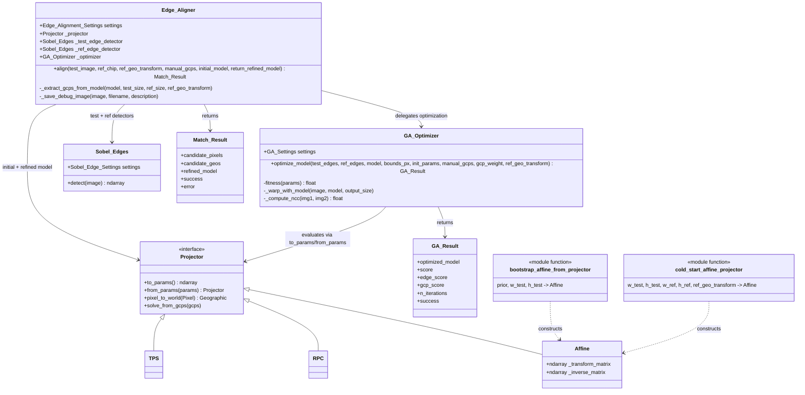
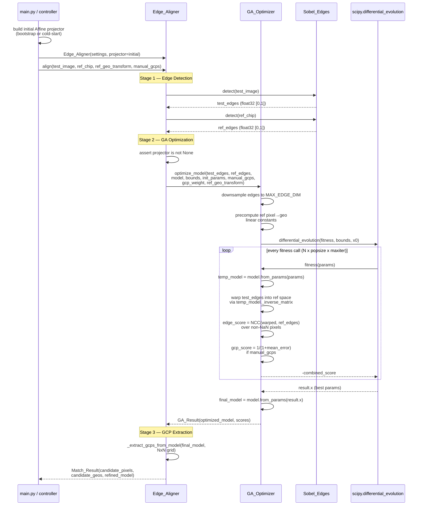
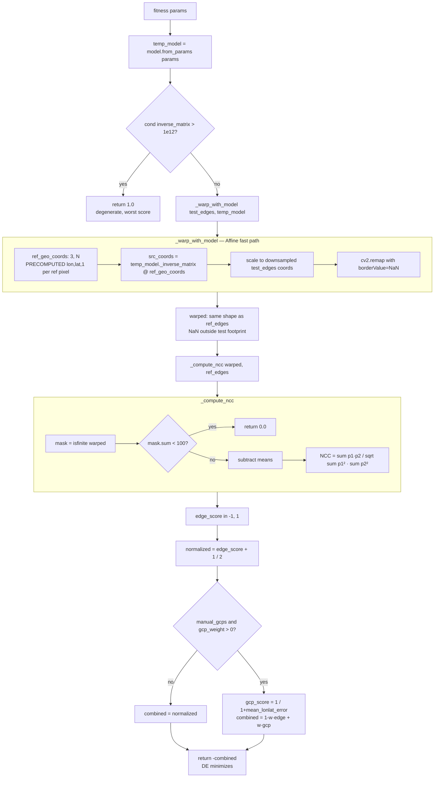
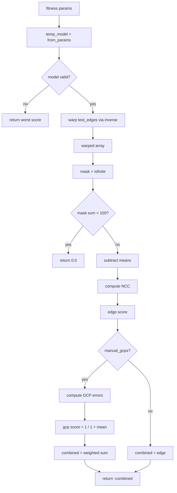
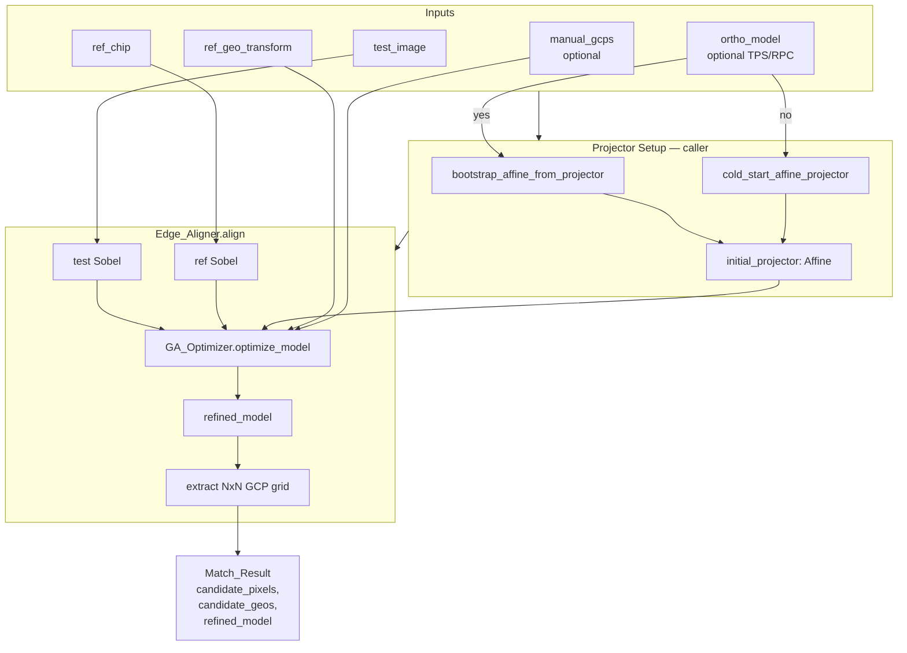

# Auto Edge Aligner (Sobel + GA)

> Edge-based genetic-algorithm alignment pipeline for fitting a projector model
> (Affine / RPC / TPS) from a test image to a georeferenced reference chip.

This document captures the **current as-implemented** state of the edge alignment
pipeline. It is intended as a working reference for design discussions and
refactors. For historical design rationale, see `docs/ai_notes/auto-gcp-solver.md`
(ALGO2 section).

---

## 1. What the algorithm does

Given:

- A **test image** (pixel grid, no geolocation)
- A **reference chip** (pixel grid + `ref_geo_transform: (px, py) → (lon, lat)`)
- An **initial projector model** (Affine) — either bootstrapped from a prior
  TPS/RPC, or cold-started from the ref extent
- Optional **manual GCPs** as soft constraints

Produce:

- A **refined projector model** (Affine for now; RPC/TPS planned) that maps
  test pixels → geographic coordinates such that the *edges* of the warped
  test image align with the *edges* of the reference chip.
- A grid of **synthetic GCPs** extracted from the refined model.

The core fitness signal is **normalized cross-correlation (NCC)** between the
Sobel edges of the warped test image and the Sobel edges of the reference chip.
The optimizer is **scipy `differential_evolution`** over the projector's
parameter vector.

---

## 2. Why edges

Cross-modal imagery (e.g. IR ↔ visible basemap) has mismatched intensities but
shared *structure*. Sobel gradient magnitude is largely invariant to radiometric
domain, making it a much more reliable correlation target than raw intensity.

---

## 3. Component architecture



**Key design point (recent refactor):** `Edge_Aligner` no longer contains
projector-initialization logic. Callers build the projector via
`bootstrap_affine_from_projector` (from TPS/RPC prior) or
`cold_start_affine_projector` (no prior) and hand it in ready-to-use. This
keeps `Edge_Aligner` agnostic to projector types.

---

## 4. End-to-end pipeline (sequence)



---

## 5. Fitness function — the hot path

Every `differential_evolution` iteration calls `fitness(params)` hundreds of
times. Understanding this path is critical to performance work.



### Current cost per fitness call

For 8192×8192 downsampled ref:

| Stage | Cost | Notes |
|---|---|---|
| `from_params` | µs | Cheap |
| Matrix multiply `@ ref_geo_coords` | ~500 ms | 6×3 × 3×67M |
| `cv2.remap` | ~300 ms | 67M pixels |
| NaN mask + NCC | ~200 ms | 67M → filter → reduce |
| **Total** | **~1 s** | Multiplied by popsize × generations |

Typical valid overlap is **20–40%** of the ref chip — meaning 60–80% of the
above cost is wasted on NaN pixels.

---

## 6. Fitness function flow

Per-fitness evaluation steps in the differential evolution optimizer:



**Note:** The current implementation checks `temp_model._inverse_matrix` condition number (Affine-specific). For projector-agnostic behavior, this should be via a `Projector.is_valid()` interface or a try/except around the warp operation.

**Invariants:**

- Ref pixel → geo is linear (tile chips are built that way) → can be
  precomputed as a single matrix multiply over all pixels once.
- Geo → test pixel is the *inverse* of the test image's projector; this is
  what the GA is optimizing.

---

## 7. Projector parameter vector (Affine)

```
params = [ m00, m01, m02,     # row 0 of 3x3 transform
          m10, m11, m12 ]     # row 1 of 3x3 transform

M = [[m00, m01, m02],
     [m10, m11, m12],
     [  0,   0,   1 ]]

M @ [px, py, 1]^T = [lon, lat, 1]^T          (pixel → world)
M^(-1) @ [lon, lat, 1]^T = [px, py, 1]^T     (world → pixel, used in fitness)
```

DE bounds (via `_affine_param_bounds`):

- Linear coefficients (m00, m01, m10, m11): ±20% of d_lon_per_px / d_lat_per_px
- Translation (m02, m12): ±`bounds_px` * d_lon_per_px / d_lat_per_px (default
  50 px)

---

## 8. Settings surface

Config path: `Edge_Alignment_Settings` → wired from the config file
(`options.auto-model-solver.cfg`).

| Setting | Default | Effect |
|---|---|---|
| `sobel_kernel_size` | 3 | Sobel derivative kernel |
| `sobel_threshold` | 0 | Binarization threshold (0 = keep magnitudes) |
| `test_pre_blur` | 5 | Gaussian pre-blur on test image |
| `ref_pre_blur` | 5 | Gaussian pre-blur on ref chip |
| `test_dilation` | 3 | Edge dilation on test side |
| `ref_dilation` | 3 | Edge dilation on ref side |
| `ga_popsize` | 15 | DE population multiplier |
| `ga_maxiter` | 200 | DE max generations |
| `ga_mutation` | (0.5, 1.0) | DE mutation range |
| `ga_recombination` | 0.7 | DE crossover |
| `ga_max_edge_dim` | 8192 | Downsample cap for fitness images |
| `search_bounds_px` | 50 | Translation search radius |
| `gcp_weight` | 0.0 | Weight for GCP term in fitness |
| `debug.save_test_sobel` | false | Dump test edges to disk |
| `debug.save_ref_sobel` | false | Dump ref edges to disk |

---

## 9. Current state — what works, what doesn't

### ✅ Works

- Sobel edge detection on both images, independently parameterized
- `bootstrap_affine_from_projector` — fits an Affine to a 5×5 grid of samples
  through any `Projector`. Proven on TPS priors.
- `cold_start_affine_projector` — fits an Affine from the ref geo extent when
  no prior is available.
- Affine parameter optimization via differential evolution
- Synthetic GCP grid extraction from the converged model
- Manual GCP term in the fitness function (soft constraint)
- Full-res ref chip caching (via `load_reference_imagery`)
- Diagnostic integration test (`test_ga_fitness_single.py`) runs a single
  fitness evaluation with detailed logging.

### 🟡 Works but is suboptimal

- **Fitness runs over the full downsampled ref** even when the test footprint
  covers only 20–40% of it. 60–80% of the matmul/remap/NCC cost is wasted on
  NaN pixels. This is the next planned refactor (per-fitness crop window).
- **`_affine_param_bounds`** is Affine-specific; bounds for non-Affine models
  are not defined.
- **Ref-chip crop block (previously inside `align()`)** has been removed —
  it was cropping based on the unreliable *initial* model, which either
  over-cropped (losing valid overlap) or was pointless.

### 🔴 Broken or stubbed

- **`_warp_with_model` for non-Affine models**: falls back to `cv2.resize`,
  which is a garbage fitness signal. GA will "converge" on nonsense params
  for RPC/TPS models. Tracked as TODO-02 in `auto-gcp-solver.md`.
- **Direct RPC parameter optimization**: not implemented. RPC priors are
  currently demoted to bootstrap Affines, losing fidelity. Tracked as
  TODO-RPC.
- **Direct TPS parameter optimization**: not possible (TPS is interpolatory),
  but TPS re-solve from refined GCPs is planned. Tracked as TODO-TPS.

---

## 10. Data flow summary



---

## 11. Known design questions (gameplan fodder)

1. **Per-fitness crop window.** Replace the full-ref fitness with a
   dynamic crop computed from each trial model's predicted test footprint.
   Expected 15–30× speedup per fitness call. Requires also building tiny
   per-crop geo-coord arrays.

2. **RPC parameter vector.** Pick a compact subset of RPC coefficients for
   GA to optimize (bias/scale offsets are the natural choice; ~10–20 DOF).
   Add `_rpc_param_bounds` and dispatch from `optimize_model`.

3. **Non-linear GA schedule.** Currently all parameters are searched
   simultaneously over their full bounds. A coarse-to-fine schedule
   (translation first, then linear coefficients) might converge faster.

4. **Multi-resolution GA.** Run the GA at a coarse pyramid level first to
   find a rough basin, then refine at full resolution. The `max_edge_dim`
   setting already supports coarse resolution; we just need a staged driver.

5. **Refinement after convergence.** The converged Affine can seed:
   - An RPC delta-offset solve (add the Affine residual to the RPC)
   - A TPS re-solve from the extracted GCP grid

6. **Ref-chip cropping revisited.** Now that the pre-GA crop has been
   removed, the full ref chip is always passed in. If the ref chip is
   much larger than the test footprint, the GA bounds on translation
   should scale — otherwise the GA will search a region that can't
   possibly overlap.

7. **GCP grid vs feature-based GCPs.** The current 4×4 grid is uniform and
   ignores the underlying imagery. Extracting GCPs at strong edge
   intersections (Harris corners in the warped overlap) would give higher
   downstream accuracy.

8. **Failure modes.**
   - Translation prior wrong by > `search_bounds_px`: GA cannot recover.
   - Test image rotated > ±20% from initial Affine: outside the default
     linear-coefficient bounds.
   - Very low edge density (cloud, water): NCC signal is dominated by noise.

---

## 12. Related files

| Path | Purpose |
|---|---|
| `src/pointy/core/match/edge_alignment/edge_aligner.py` | Orchestrator + helpers |
| `src/pointy/core/match/edge_alignment/ga_optimizer.py` | DE optimizer + fitness |
| `src/pointy/core/match/edge_alignment/sobel_edges.py` | Edge detector |
| `src/pointy/core/auto_match.py` | `Edge_Alignment_Settings` |
| `src/pointy/apps/auto_model_solver/main.py` | CLI entry point |
| `src/pointy/controllers/auto_model_solver_controller.py` | GUI worker thread |
| `test/integration/test_ga_fitness_single.py` | Single-fitness diagnostic test |
| `docs/ai_notes/auto-gcp-solver.md` | Historical design notes (ALGO1 + ALGO2) |

---

## TODO

### High Priority

- [ ] **Refactor `_warp_with_model` to use pure Projector APIs**
  - Currently uses `temp_model._inverse_matrix` (Affine-specific)
  - Should use `temp_model.world_to_pixel()` for geo → test pixel
  - Projector already has `world_to_pixel()` and `compute_remap_coordinates()` (bulk method)
  - Add `Projector.is_valid()` interface or use try/except around warp for degenerate check

- [ ] **Per-fitness crop window**
  - Compute crop from trial model's predicted test footprint
  - Extract ref sub-view at crop region
  - Warp test edges into the sub-view
  - Compute NCC on two same-size sub-images
  - Expected 15–30× speedup per fitness call

- [ ] **Direct RPC parameter optimization**
  - Implement `RPC.to_params()` / `RPC.from_params()` for a compact offset vector
  - Update `_affine_param_bounds` to dispatch to model-specific bounds function
  - Currently RPC priors are demoted to bootstrap Affines, losing fidelity

### Medium Priority

- [ ] **Evaluate bulk Projector methods for fitness function**
  - Projector already has `compute_remap_coordinates(lon_mesh, lat_mesh, src_w, src_h)`
  - Determine if this can replace the custom `_warp_with_model` implementation
  - May need to adapt the fitness function to work with the mesh-based API

- [ ] **GCP extraction ref validation**
  - After extracting geo points from the model, verify they lie within the reference chip bounds
  - Flag or drop points that fall outside

- [ ] **TPS refinement from GCP grid**
  - After GA converges on Affine, re-solve TPS from the extracted GCP grid
  - TPS is interpolatory, so it will pass exactly through the grid points

### Low Priority / Future

- [ ] **Multi-resolution GA schedule**
  - Run GA at coarse pyramid level first, then refine at full resolution
  - Could converge faster in the rough basin

- [ ] **Refinement after convergence**
  - Use converged Affine to seed RPC delta-offset solve
  - Iterative refinement: re-run edge alignment with updated RPC/TPS as prior
